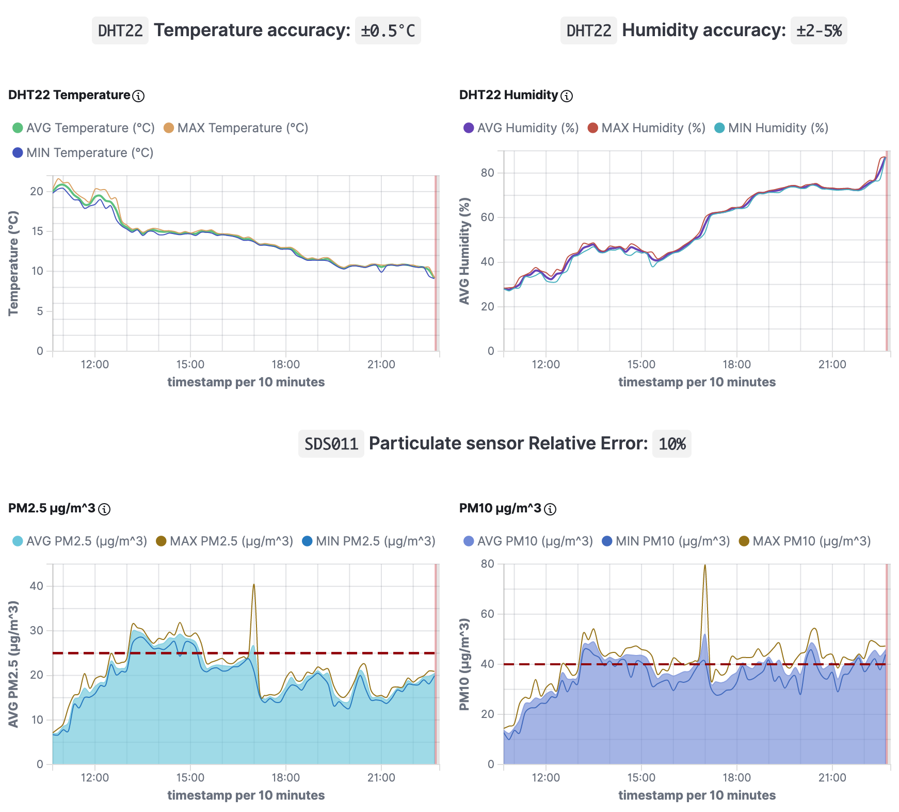
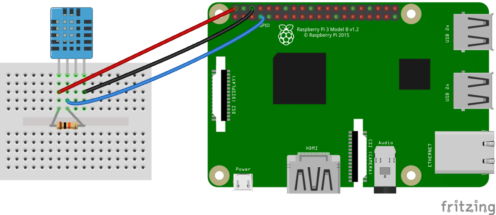

[](https://github.com/xtimk/pm10-weather-station/blob/master/LICENSE) [](https://www.python.org/)

# Particulate Raspberry Pi Station
Python based batch software that collects Temperature Humidity PM2.5 and PM10 from sensors and stores them in an Elasticsearch/Opensearch instance.



I'm running this project in Udine (Italy). You can check real-time stats [here](http://vps-38c91410.vps.ovh.net/weather-station/weather-station-ud.html)
## What do you need to run this project
 - A `Raspberry Pi`. Project was tested on a `RPi 2`, but it should be compatible with `RPi 3` and `4`)
 - `DHT11` or `DHT22` (or both if you want) temperature & humidity sensors. 
I would recommend the `DHT22`  since it's far more precise than `DHT11`. You may also need a `10K Ohm` resistor if you have the standalone modules.
 - `SDS011` pm2.5 and pm10 sensor. In this project you will attach this sensor to an usb port of the RPi


## Wiring Raspberry with `DHT11`/`DHT22`
`DHT11/DHT22` are distributed in two versions:
 - A PCB module mounted with 3 pins. You don't need any extra resistor because it's included in the PCB
 - A standalone module with 4 pins. If you have this you also need a `10K Ohm` resistor.

Below are shown two examples configured to use `pin 4` as data, but you can use any pin data you want.


#### Example of wiring the PCB module:


#### Here is an example of wiring the standalone module:



You can find the detailed description about wiring raspberry with the `DHT11/DHT22` on [circuitbasics.com](http://www.circuitbasics.com/how-to-set-up-the-dht11-humidity-sensor-on-the-raspberry-pi/)
## Wiring Raspberry with `SDS011`
Simply attach the sensor to a free usb port. Then you can determine the device id where you attached the sensor by running
```bash
dmesg | grep usb
```
In the output look for a line where compares `ch341-uart`
For example from this output I can determine that the sensor is attached to `/dev/ttyUSB0`.
```bash
[ 17.653578] usb 1-1.2: ch341-uart converter now attached to ttyUSB0
```

## Prerequisites
You will need `python3` on your RPi in order to run this project.
To install the required libraries you can run
```bash
pip3 install -r requirements.txt
```
## Configuration
You can setup all the parameters in the `config.yaml` file.

### Configure Sensors
You can setup the data pins of the `DHT11` and `DHT22` by setting the parameters `dht11_data_pin` and `dht22_data_pin`
Example:
```bash
dht11_data_pin: 4
dht22_data_pin: 17
```

Setup device where SDS011 is attached
```bash
sds011_serial_port: "/dev/ttyUSB0"
```

### Configure Elasticsearch
Setup elasticsearch address and protocol
```bash
es_address: "my-es-instance:9200"
es_proto: "http"
```
If you have security enabled in your Elasticsearch set this to `1`
```bash
es_basic_auth: 1
```
Set user and password
```bash
es_user: "elastic"
es_pass: "MYNASASECRETEPASSWORD"
```
Set index output name
```bash
es_index_name: "my-pm10-station"
```
You can start editing from the `config.yaml` included in this repo.

## Testing Sensors
You can run all tests to verify that all sensors are ok:
```bash
./run_tests.sh
```
If it's all ok the output should look like:
```bash
Starting tests...
........
----------------------------------------------------------------------
Ran 8 tests in 11.869s

OK
```

## Run the Project

You can run the project once by executing
```bash
python 3 read_sensors_data.py
```

This will measure temperature humidity pm2.5 and pm10, index them to Elasticsearch, and print to console all these values
```bash
----- SENSORS DATA -----
* DHT11 Sensor data:
* >> Temperature: 6.00°C (±2°C)
* >> Humidity : 50.00 % (±5%)
------------------------
* DHT22 Sensor data:
* >> Temperature: 6.70°C (±0.5°C)
* >> Humidity : 67.30 % (±2-5 %)
------------------------
* SDS011 Sensor data:
* >> PM2.5: 35.30 µg/m^3 (Rel. Error: 10%)
* >> PM10 : 58.10 µg/m^3 (Rel. Error: 10%)
------------------------
```

The `read_sensors_data.py` is intended to be run every `x` minutes. 
Assuming you have cloned the repo in `/root` we can for example setup `cron` in order to gather sensors data every 2 minutes
Open crontab
```bash
crontab -e
```
And add the following line
```bash
*/2 * * * *  root  python3 /root/pm10-weather-station/read_sensors_data.py
```
Now all you have to do is to create some cool graphs in Elasticsearch and enjoy :D
